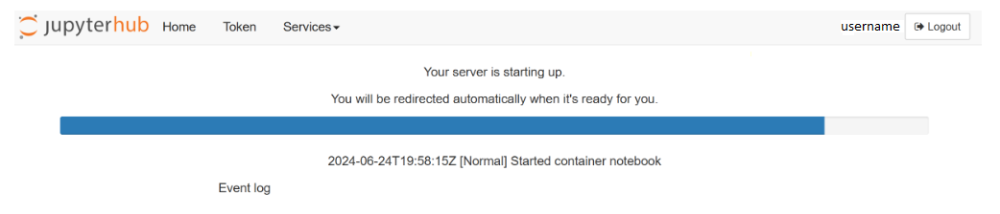
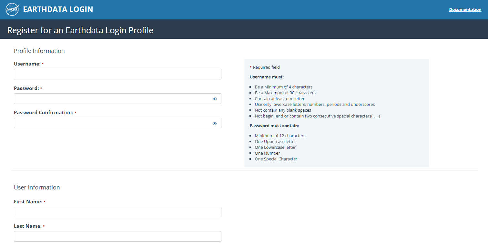

# Initial Setup 

## 1- Accesing to the 2i2c Hub
To login to the 2i2c Hub, follow these simple steps:

* **Head to the Hub:** Visit this link to access the 2i2c Hub: https://climaterisk.opensci.2i2c.cloud/.

* **Log in with your Credentials:**

**Username:** Feel free to choose any username you like.  Te recommend your GitHub username helps avoid conflicts with others.

**Password:** You'll receive the password the day before the tutorial.


* **Logging In:**

The login process might take a few minutes, especially if a new virtual workspace needs to be created just for you. 





* **What to Expect:**

By default,  logging into https://climaterisk.opensci.2i2c.cloud will automatically clone https://github.com/ScienceCore/scipy-2024-climaterisk and change to that directly. If the login is successful, you will see the following screen. 


 

Finally, if you see the previous JupyterLab screen, you are ready to start working.

**Notes:** Any files you work on will be saved between sessions as long as you use the same username.


## 2. Using NASA's Earthdata

### Brief Introduction

The NASA Earth Science Data Systems (ESDS) program oversees the lifecycle of Earth science data from all its Earth observation missions, from acquisition to processing and distribution.

For the purposes of this guide, the NASA Earthdata website is the entry point that allows full, free and open access to NASA's Earth science data collections, in order to accelerate scientific progress for the benefit of society. To access the data through this portal, users must first define their access credentials. To create an EarthData account, follow these steps:

Go to the Earth Nasa website: https://www.earthdata.nasa.gov/. Then, select the option "Use Data" and then "Register". Finally, go to https://urs.earthdata.nasa.gov/.

 

Select the "Register for a profile" option, there choose a username and password. As a suggestion, choose ones that you remember well, as you will need them later. You will also need to complete your profile to complete the registration, where you will be asked for information such as email, country, affiliation, among others. Finally, choose "Register for Earthdata Login".

 

## 3. Data Configuration for Access from Jupyter Notebooks


Now comes the technical part: to access data from Python programs and Jupyter notebooks, it is necessary to save the credentials (from EarthData) in a special file. In this repository you will find a file called .netrc with an example (you can think of it as a template). Open that file and edit the following line:
```

machine urs.earthdata.nasa.gov login {your_username} password {your_password}
```

Then, replace `{your_username}` and `{your_password} `with your account details. Save the file and you're done! You now have everything you need to access Earth observation data through the EarthData portal. ️

To make sure everything is working properly, open the notebook titled `1_getting_started.ipynb` and follow the instructions. With this, you will be able to explore the world of NASA data!


